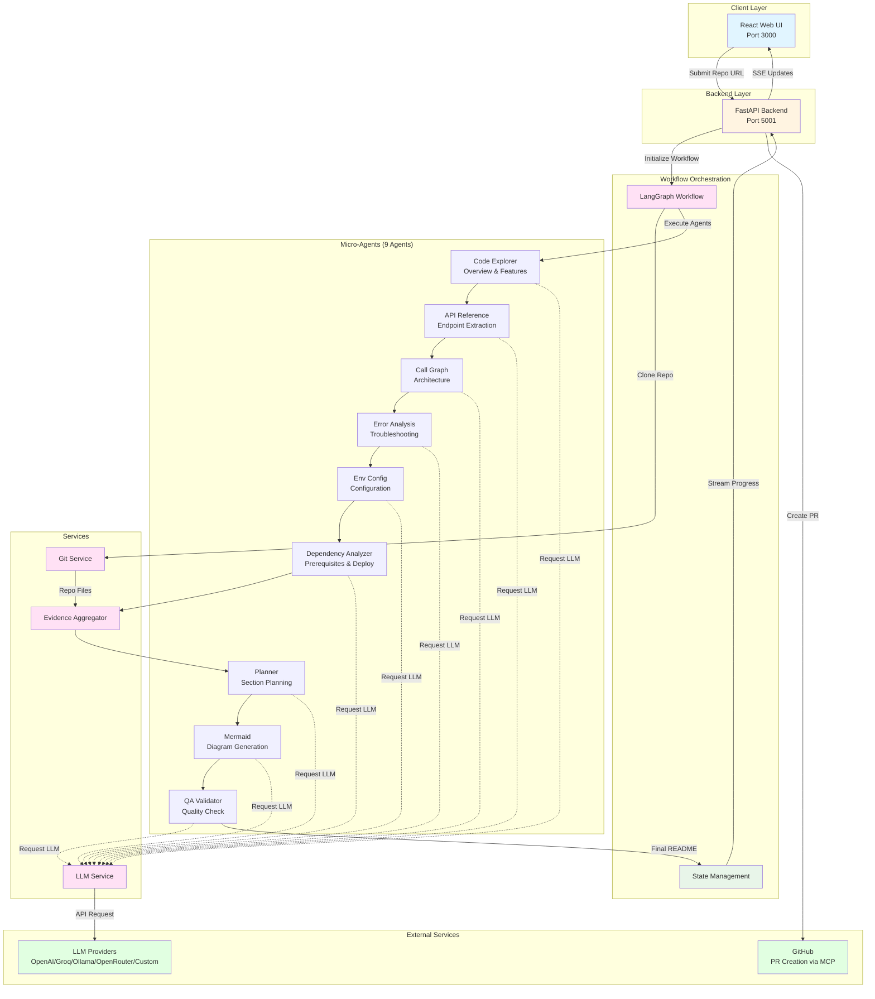

<p align="center">
  
</p>

# 📚 DocuBot - AI Documentation Generator

AI-powered documentation generation using multi-provider LLMs and specialized micro-agent architecture for comprehensive README creation.

---

## 📋 Table of Contents

- [Project Overview](#project-overview)
- [Architecture](#architecture)
- [Get Started](#get-started)
  - [Prerequisites](#prerequisites)
  - [Quick Start](#quick-start)
- [Project Structure](#project-structure)
- [Usage Guide](#usage-guide)
- [LLM Provider Configuration](#llm-provider-configuration)
- [Environment Variables](#environment-variables)
- [Technology Stack](#technology-stack)
- [Troubleshooting](#troubleshooting)
- [License](#license)

---

## Project Overview

**DocuBot** is an intelligent documentation generation platform that analyzes GitHub repositories using specialized micro-agents to automatically create comprehensive, well-structured README documentation with minimal human intervention.

### How It Works

1. **Repository Analysis**: Users provide a GitHub repository URL. The system clones and analyzes the codebase structure, dependencies, and configuration files.
2. **Multi-Agent Processing**: 9 specialized micro-agents work in parallel to extract different aspects: project overview, features, architecture, API endpoints, error handling, configuration, deployment, and troubleshooting.
3. **Evidence-Based Generation**: The system collects concrete evidence from the codebase (dependencies, Docker files, config files) to ensure factually accurate documentation.
4. **Quality Validation**: A QA agent validates all sections against evidence to prevent hallucinations and ensure documentation quality.
5. **Automated PR Creation**: Optionally creates a GitHub Pull Request with the generated README using the Model Context Protocol (MCP).

The platform supports multiple LLM providers (OpenAI, Groq, Ollama, OpenRouter, or any OpenAI-compatible API), allowing teams to choose the best option for their deployment needs. The backend uses LangGraph for workflow orchestration and provides real-time processing updates via Server-Sent Events.

---

## Architecture

This application uses a micro-agent architecture where specialized agents collaborate to generate comprehensive documentation. The React frontend communicates with a FastAPI backend that orchestrates the multi-agent workflow through LangGraph. The backend integrates with multiple LLM providers through a universal client, enabling flexible deployment options across cloud APIs and local models.



**Service Components:**

1. **React Web UI (Port 3000)** - Provides repository URL input, real-time agent progress tracking with Server-Sent Events, generated README preview with syntax highlighting, and PR creation interface

2. **FastAPI Backend (Port 5001)** - Handles API routing, orchestrates workflow execution, manages job state, and serves JSON/SSE responses to the frontend

3. **LangGraph Workflow** - Orchestrates sequential execution of 9 micro-agents, manages state transitions, handles interrupts for monorepo project selection, and checkpoints workflow state

4. **Micro-Agents (9 Specialized Agents)**:
   - **Code Explorer**: Analyzes project structure to write Overview & Features sections
   - **API Reference**: Extracts API endpoints and routes from code
   - **Call Graph**: Maps component relationships for Architecture section
   - **Error Analysis**: Identifies error handlers for Troubleshooting section
   - **Env Config**: Discovers configuration files for Configuration section
   - **Dependency Analyzer**: Extracts dependencies for Prerequisites & Deployment sections
   - **Planner**: Decides which sections to include based on project type
   - **Mermaid**: Generates architecture diagrams with semantic validation
   - **QA Validator**: Validates documentation against evidence to prevent hallucinations

5. **LLM Service** - Universal adapter supporting multiple LLM providers (OpenAI, Groq, Ollama, OpenRouter, custom APIs, enterprise inference) with retry logic and SSL verification

6. **Git Service** - Handles repository cloning, branch detection, monorepo analysis, and cleanup

7. **Evidence Aggregator** - Collects concrete evidence from filesystem (dependencies, Docker files, config files, languages) to ensure factual accuracy

**Typical Flow:**

1. User submits GitHub repository URL through the web UI
2. Backend initializes workflow and clones the repository
3. System detects if repository is a monorepo (multiple projects)
4. If monorepo, user selects which project to document (interrupt point)
5. Six section writer agents execute in sequence, analyzing code and generating sections
6. Evidence aggregator collects filesystem evidence (dependencies, Docker, configs)
7. Planner agent decides which sections to include based on project type
8. Mermaid agent generates architecture diagram
9. QA agent validates all sections against collected evidence
10. Assembly node combines sections into final README
11. User can download README or create a GitHub PR with one click

---

## Get Started

### Prerequisites

Before you begin, ensure you have the following installed and configured:

- **Docker and Docker Compose** (v20.10+)
  - [Install Docker](https://docs.docker.com/get-docker/)
  - [Install Docker Compose](https://docs.docker.com/compose/install/)
- **LLM Provider Access** (choose one):
  - [OpenAI API Key](https://platform.openai.com/account/api-keys) (Recommended)
  - [Groq API Key](https://console.groq.com/keys) (Fast & Free Tier)
  - [Ollama Local Installation](https://ollama.com) (Private/Local)
  - [OpenRouter API Key](https://openrouter.ai/keys) (Multi-Model)
  - Any OpenAI-compatible API endpoint

#### Verify Installation

```bash
# Check Docker
docker --version
docker compose version

# Verify Docker is running
docker ps
```

### Quick Start (Docker Deployment)

**Recommended for most users - runs everything in containers**

#### 1. Clone or Navigate to Repository

```bash
# If cloning:
git clone https://github.com/cld2labs/DocuBot.git
cd DocuBot
```

#### 2. Configure Backend Environment

Copy the example configuration and add your API key:

```bash
# Copy backend environment template
cd api

cp api/.env.example api/.env

# Edit the file and add your API key
nano api/.env
```

Update `api/.env` with your LLM provider credentials:

```bash
LLM_PROVIDER=openai
LLM_API_KEY=your_actual_api_key_here
LLM_BASE_URL=https://api.openai.com/v1
LLM_MODEL=gpt-4o
```

**For other providers**, see [LLM Provider Configuration](#llm-provider-configuration) section.

#### 3. Launch the Application

```bash
# Build and start all services
docker compose up -d --build

# View logs (optional)
docker compose logs -f
```

#### 4. Access the Application

Once containers are running:

- **Frontend UI**: http://localhost:3000
- **Backend API**: http://localhost:5001
- **API Documentation**: http://localhost:5001/docs

#### 5. Verify Services

```bash
# Check health status
curl http://localhost:5001/health

# Check all services are running
docker compose ps
```

#### 6. Stop the Application

```bash
docker compose down
```

---

### Local Development Setup

**For developers who want to run services locally without Docker**

#### 1. Prerequisites

- Python 3.11+
- Node.js 20+
- Your chosen LLM provider API key

#### 2. Backend Setup

```bash
cd api

# Create virtual environment
python -m venv venv
source venv/bin/activate  # On Windows: venv\Scripts\activate

# Install dependencies
pip install -r requirements.txt

# Configure environment
cp .env.example .env
nano .env  # Add your API key

# Start backend
uvicorn server:app --reload --port 5001
```

Backend will run on `http://localhost:5001`

#### 3. Frontend Setup

Open a new terminal:

```bash
cd ui

# Install dependencies
npm install

# Configure environment for local development
cp .env.example .env

# Edit .env and set:
# VITE_API_URL=http://localhost:5001
nano .env

# Start frontend
npm run dev
```

Frontend will run on `http://localhost:3000`

#### 4. Access the Application

- **Frontend**: http://localhost:3000
- **Backend API**: http://localhost:5001
- **API Docs**: http://localhost:5001/docs

**Note**: For local development, the frontend `.env` file **must** contain:
```bash
VITE_API_URL=http://localhost:5001
```

This tells the frontend where to find the backend API.

---

## Project Structure

```
DocuBot/
├── api/
│   ├── agents/
│   │   ├── code_explorer_agent.py       # Overview & Features writer
│   │   ├── api_reference_agent.py       # API endpoint extractor
│   │   ├── call_graph_agent.py          # Architecture writer
│   │   ├── error_analysis_agent.py      # Troubleshooting writer
│   │   ├── env_config_agent.py          # Configuration writer
│   │   ├── dependency_analyzer_agent.py # Prerequisites & Deployment writer
│   │   ├── planner_agent.py             # Section planner
│   │   ├── mermaid_agent.py             # Diagram generator
│   │   ├── qa_validator_agent.py        # Quality validator
│   │   └── pr_agent_mcp.py              # PR creation via MCP
│   ├── services/
│   │   ├── llm_service.py               # Universal LLM provider client
│   │   └── git_service.py               # Git operations
│   ├── models/
│   │   ├── schemas.py                   # Pydantic data models
│   │   ├── state.py                     # Workflow state
│   │   ├── evidence.py                  # Evidence structures
│   │   └── log_manager.py               # SSE logging
│   ├── tools/
│   │   ├── repo_tools.py                # Repository analysis tools
│   │   └── new_analysis_tools.py        # Code analysis utilities
│   ├── utils/
│   │   ├── project_detector.py          # Monorepo detection
│   │   └── metrics_extractor.py         # Token usage metrics
│   ├── core/
│   │   ├── metrics_collector.py         # Performance tracking
│   │   └── agent_event_logger.py        # ReAct event logging
│   ├── mcp_client/
│   │   └── github_mcp_client.py         # GitHub MCP integration
│   ├── workflow.py                      # LangGraph workflow definition
│   ├── server.py                        # FastAPI application entry point
│   ├── config.py                        # Environment configuration
│   ├── requirements.txt                 # Python dependencies
│   └── Dockerfile                       # Backend container
├── ui/
│   ├── src/
│   │   ├── pages/
│   │   │   └── HomePage.tsx             # Main documentation generation page
│   │   ├── components/
│   │   │   └── ui/                      # Reusable UI components
│   │   ├── services/
│   │   │   └── api.ts                   # API client utilities
│   │   └── types/                       # TypeScript type definitions
│   ├── package.json                     # npm dependencies
│   ├── vite.config.ts                   # Vite configuration
│   └── Dockerfile                       # Frontend container
├── docs/
│   └── assets/                          # Documentation assets
├── docker-compose.yml                   # Service orchestration
├── .env.example                         # Environment variable template
├── README.md                            # Project documentation
├── TROUBLESHOOTING.md                   # Troubleshooting guide
├── CONTRIBUTING.md                      # Contribution guidelines
├── SECURITY.md                          # Security policy
├── DISCLAIMER.md                        # Usage disclaimer
├── LICENSE.md                           # MIT License
└── TERMS_AND_CONDITIONS.md              # Terms of use
```

---

## Usage Guide

### Using DocuBot

1. **Open the Application**
   - Navigate to `http://localhost:3000`

2. **Enter Repository URL**
   - Paste a GitHub repository URL (e.g., `https://github.com/owner/repo`)
   - Supports branch-specific URLs (e.g., `https://github.com/owner/repo/tree/dev`)
   - Supports subfolder URLs (e.g., `https://github.com/owner/repo/tree/main/backend`)

3. **Start Documentation Generation**
   - Click "Generate Documentation" button
   - Watch real-time agent progress in the activity panel
   - See which agent is currently running and what it's doing

4. **Handle Monorepo Selection (if needed)**
   - If the repository contains multiple projects, you'll be prompted to select one
   - Choose the project you want to document
   - System will focus analysis on that specific project

5. **Review Generated README**
   - Once complete, the README preview appears with syntax highlighting
   - Review all sections: Overview, Features, Architecture, Prerequisites, Deployment, etc.
   - Check the architecture diagram generated by the Mermaid agent

6. **Download or Create PR**
   - **Download**: Click "Download README.md" to save locally
   - **Create PR**: Click "Create Pull Request" to automatically:
     - Create a new branch (docs/update-readme-{timestamp})
     - Commit the README
     - Open a PR against the repository's default branch

### Performance Tips

- **Model Selection**: For faster processing, use `gpt-4o-mini` or Groq's `llama-3.2-90b-text-preview`
- **Local Development**: Use Ollama with `qwen2.5:7b` for private, offline documentation generation
- **Monorepo**: Select specific subprojects for focused documentation
- **PR Creation**: Requires `GITHUB_TOKEN` with `repo` scope in `api/.env`

---

## LLM Provider Configuration

DocuBot supports multiple LLM providers. Choose the one that best fits your needs:

### OpenAI (Recommended for Production)

**Best for**: Highest quality outputs, production deployments

- **Get API Key**: https://platform.openai.com/account/api-keys
- **Models**: `gpt-4o`, `gpt-4-turbo`, `gpt-4o-mini`
- **Pricing**: Pay-per-use (check [OpenAI Pricing](https://openai.com/pricing))
- **Configuration**:
  ```bash
  LLM_PROVIDER=openai
  LLM_API_KEY=sk-...
  LLM_BASE_URL=https://api.openai.com/v1
  LLM_MODEL=gpt-4o
  ```

### Groq (Fast & Free Tier)

**Best for**: Fast inference, development, free tier testing

- **Get API Key**: https://console.groq.com/keys
- **Models**: `llama-3.2-90b-text-preview`, `llama-3.1-70b-versatile`
- **Free Tier**: 30 requests/min, 6,000 tokens/min
- **Pricing**: Very competitive paid tiers
- **Configuration**:
  ```bash
  LLM_PROVIDER=groq
  LLM_API_KEY=gsk_...
  LLM_BASE_URL=https://api.groq.com/openai/v1
  LLM_MODEL=llama-3.2-90b-text-preview
  ```

### Ollama (Local & Private)

**Best for**: Local deployment, privacy, no API costs, offline operation

- **Install**: https://ollama.com/download
- **Pull Model**: `ollama pull qwen2.5:7b`
- **Models**: `qwen2.5:7b`, `llama3.1:8b`, `llama3.2:3b`
- **Pricing**: Free (local hardware costs only)
- **Configuration**:
  ```bash
  LLM_PROVIDER=ollama
  LLM_API_KEY=  # Leave empty - no API key needed
  LLM_BASE_URL=http://localhost:11434/v1
  LLM_MODEL=qwen2.5:7b
  ```
- **Setup**:
  ```bash
  # Install Ollama
  curl -fsSL https://ollama.com/install.sh | sh

  # Pull model
  ollama pull qwen2.5:7b

  # Verify it's running
  curl http://localhost:11434/api/tags
  ```

### OpenRouter (Multi-Model Access)

**Best for**: Access to multiple models through one API, model flexibility

- **Get API Key**: https://openrouter.ai/keys
- **Models**: Claude, Gemini, GPT-4, Llama, and 100+ others
- **Pricing**: Varies by model
- **Configuration**:
  ```bash
  LLM_PROVIDER=openrouter
  LLM_API_KEY=sk-or-...
  LLM_BASE_URL=https://openrouter.ai/api/v1
  LLM_MODEL=anthropic/claude-3-haiku
  ```

### Custom OpenAI-Compatible API

**Best for**: Custom deployments, internal APIs, alternative providers

Any API that implements the OpenAI chat completions format will work:

```bash
LLM_PROVIDER=custom
LLM_API_KEY=your_api_key
LLM_BASE_URL=https://your-custom-endpoint.com/v1
LLM_MODEL=your-model-name
```

### Switching Providers

To switch providers, simply update `api/.env` and restart:

```bash
# Edit configuration
nano api/.env

# Restart backend only
docker compose restart api

# Or restart all services
docker compose down
docker compose up -d
```

---

## Environment Variables

Configure the application behavior using environment variables in `api/.env`:

### Core LLM Configuration

| Variable | Description | Default | Type |
|----------|-------------|---------|------|
| `LLM_PROVIDER` | LLM provider name (openai, groq, ollama, openrouter, custom) | `openai` | string |
| `LLM_API_KEY` | API key for the provider (empty for Ollama) | - | string |
| `LLM_BASE_URL` | Base URL for the LLM API | `https://api.openai.com/v1` | string |
| `LLM_MODEL` | Model name to use | `gpt-4o` | string |

### Generation Parameters

| Variable | Description | Default | Type |
|----------|-------------|---------|------|
| `TEMPERATURE` | Model creativity level (0.0–1.0, lower = deterministic) | `0.7` | float |
| `MAX_TOKENS` | Maximum tokens per response | `1000` | integer |
| `MAX_RETRIES` | Number of retry attempts for API failures | `3` | integer |
| `REQUEST_TIMEOUT` | Request timeout in seconds | `300` | integer |

### Repository Analysis

| Variable | Description | Default | Type |
|----------|-------------|---------|------|
| `TEMP_REPO_DIR` | Temporary directory for cloned repositories | `./tmp/repos` | string |
| `MAX_REPO_SIZE` | Maximum repository size in bytes | `10737418240` (10GB) | integer |
| `MAX_FILE_SIZE` | Maximum file size to analyze | `1000000` (1MB) | integer |
| `MAX_FILES_TO_SCAN` | Maximum files to analyze | `500` | integer |

### GitHub Integration

| Variable | Description | Default | Type |
|----------|-------------|---------|------|
| `GITHUB_TOKEN` | Personal access token for PR creation | - | string |

### Server Configuration

| Variable | Description | Default | Type |
|----------|-------------|---------|------|
| `API_PORT` | Backend service port | `5001` | integer |
| `HOST` | Server host binding | `0.0.0.0` | string |
| `CORS_ORIGINS` | Allowed CORS origins | `["http://localhost:3000"]` | list |

**Example .env file** is available at `api/.env.example` in the repository.

---

## Technology Stack

### Backend
- **Framework**: FastAPI (Python web framework with async support)
- **Workflow Orchestration**: LangGraph with memory checkpointing
- **AI Framework**: LangChain for agent tools and abstractions
- **LLM Providers**:
  - OpenAI GPT-4o (text generation)
  - Groq Llama (fast inference)
  - Ollama (local deployment)
  - OpenRouter (multi-model access)
  - Custom OpenAI-compatible APIs
- **Multi-Agent System**:
  - 9 specialized micro-agents
  - Evidence-based generation
  - Quality validation with guardrails
  - Semantic Mermaid diagram validation
- **Git Operations**: GitPython for repository management
- **GitHub Integration**: MCP (Model Context Protocol) for PR creation
- **Code Analysis**: AST parsing with astroid
- **Async Server**: Uvicorn (ASGI)
- **Config Management**: Pydantic Settings with python-dotenv

### Frontend
- **Framework**: React 18 with TypeScript
- **Build Tool**: Vite (fast bundler)
- **Styling**: Tailwind CSS + PostCSS
- **UI Components**: Custom design system with Lucide React icons
- **State Management**: React hooks (useState, useEffect)
- **API Communication**:
  - Axios for REST calls
  - Fetch API for Server-Sent Events (SSE)
- **Markdown Rendering**: react-markdown with syntax highlighting

### Infrastructure
- **Containerization**: Docker + Docker Compose
- **Frontend Server**: Nginx (unprivileged)
- **Health Checks**: Docker health monitoring
- **Networking**: Docker bridge network

---

## Troubleshooting

For comprehensive troubleshooting guidance, common issues, and solutions, refer to:

[Troubleshooting Guide - TROUBLESHOOTING.md](./TROUBLESHOOTING.md)

### Quick Debug

**Check service health:**
```bash
curl http://localhost:5001/health
docker compose ps
```

**View logs:**
```bash
docker compose logs api --tail 50
docker compose logs ui --tail 50
```

**Enable debug mode:**
```bash
# Update api/.env
LOG_LEVEL=DEBUG

# Restart backend
docker compose restart api
```

---

## License

This project is licensed under the terms specified in [LICENSE.md](./LICENSE.md) file.

---

## Disclaimer

**DocuBot** is provided as-is for documentation generation purposes. While we strive for accuracy:

- Always review AI-generated documentation before publication
- Verify technical details and implementation specifics
- Do not rely solely on AI for critical documentation
- Test thoroughly before using in production environments
- Consult subject matter experts for domain-specific accuracy

For full disclaimer details, see [DISCLAIMER.md](./DISCLAIMER.md)

---
